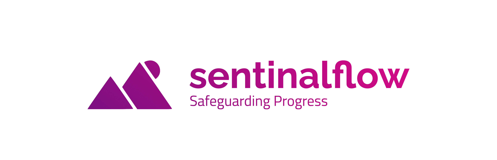

# SentinelFlow

SentinelFlow is a powerful open-source microservices communication library that integrates the concept of Flow Management in saga orchestration. It addresses security concerns in microservices connectivity by leveraging port switching, fake messages propagation, and encryption to protect against unauthorized access and potential attacks.

    ⚠ This project is under construct

## Introduction

Microservices architecture brings flexibility and scalability to modern applications but introduces challenges in managing communication and ensuring security. SentinelFlow mitigates these challenges by providing a robust and secure communication infrastructure for microservices.

## Features

- **Flow Management**: Simplifies saga orchestration in microservices.
- **Security**: Enhances security through port switching, fake messages propagation, and encryption.
- **Language Support**: Clients Written in multiple languages, including Node.js, Go, Java, Python, and more.

## Getting Started

Visit our [official documentation](https://github.com/your-username/SentinelFlow/wiki) for detailed instructions on getting started, architecture, and usage examples.

## License

SentinelFlow is licensed under the [Endless Eureka License version 1.0.0 (EEL1)](LICENSE.md).

### EEL1 License Summary:

- **Free to use in open-source projects**
- **Required attribution in commercial projects**
- **Optional in private and free projects with no associated cost**
- **Government End Users in the U.S. and I.R. are subject to specific terms (see license for details)**

## Contribution

We welcome contributions! Please follow our [contribution guidelines](CONTRIBUTING.md) to contribute to SentinelFlow.

## Support and Community

Join our community on [Discord](https://discord.gg/SentinelFlow) for discussions, support, and announcements.

## Stay Connected

Follow us on [Twitter](https://twitter.com/SentinelFlow) for updates and news.

---

**© 2023 SentinelFlow. All Rights Reserved.**
